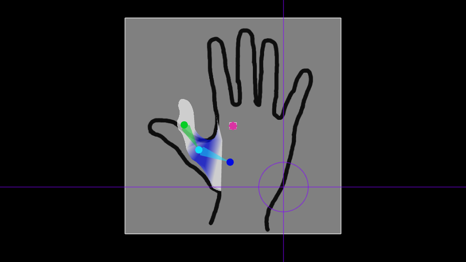

# "Mesher"

A 2d triangle mesh editor for low-poly "smooth" models.  
Made with SFML and OpenGL.  

## Motivation and Paradigm

In the course of several OpenGL projects, it became desirable to use smooth 2d models for artistic purposes. Extensive use of animatable particle effects was desired.  
Though no benchmarks were run, there was concern over the available options.  

- Near-smoothness by high-poly approximations is instancing-friendly, but it sacrifices animatability and sets upper bounds on scaling.
- Smoothness by SVG graphics is truly smooth and animatable, but is not instanceable.

Therefore, in an attempt to make the best of both worlds, "smooth triangles" were employed.  
There are only concave, convex, and full triangles. These then act within the paradigm of a usual 2d triangle mesh, to create an instanceable, responsively-animatable mesh.  

This paradigm was easily implemented as a shader, but no tools existed (that I know of) to creatively interact with meshes that visually harnessed convexity/concavity.  
Therefore, this hobby project was created.  

## Use Illustrations

## Features

- Vertex XY, UV, indexed color, and parent bone modification suite.
- Layer use and management
- Reference use (source texture for UV modification, external reference for all other modifications)
- Test skeleton for pose/animation testing

## To-Do

- Implement save/load and export/import features
- Tidy dependencies